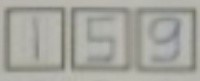
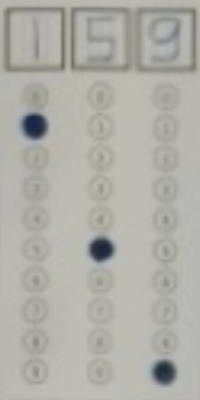

### Web App Repository : [HERE](https://github.com/malifalhakim/sistem-perhitungan-suara-otomatis)

# Penjelasan

### Folder RawDataset

Folder `RawDataset` berisi dataset awal yang masih belum diproses. Didalamnya juga terdapat label dan sample submission yang diberikan.

### Folder AnnotationV1

Folder ini berisi anotasi dari setiap gambar pada dataset untuk melakukan _cropping_ pada gambar. Berikut adalah contoh hasil _cropping_-nya:



### Folder AnnotationV2

Folder ini berisi anotasi dari setiap gambar dengan versi yang berbeda. Berikut adalah contoh hasil cropping dari anotasi ini:



### Folder Image Processing

Folder ini berisi kode python untuk melakukan image processing bird view dan image augmentation. Didalamnya terdapat folder `train` dan `test` yang mana di setiap folder tersebut terdapat folder `images` dan `labels`. Folder `images` berisi gambar dari `RawDataset` yang ingin di-_crop_ dan Folder `labels` berisi anotasi yang ingin digunakan untuk melakukan _crop_. Dan hasil dari _cropping_ akan keluar di folder `train_result` dan `test_result`.

Folder ini juga berisi folder `augmentation` yang dapat diisi dengan gambar yang ingin di augmentasi menggunakan `augmentation.py`. Hasil dari augmentasi akan disimpan di folder `augmentation_result`.

### Folder DatasetV1

Folder ini berisi hasil preprocessing yang telah dilakukan menggunakan `image_processing.py` dan `augmentation.py`. Dimana raw dataset dilakukan _cropping_ dan augmentasi. Terdapat juga file label dan notebook untuk menyesuaikan label sesuai dataset

### Folder Dataset V2

Folder ini berisih hasil preprocessing yang telah dilakukan menggunakan `image_processing.py`. Terdapat juga file label dan notebook untuk menyesuaikan label sesuai dataset

### Folder PaddleOCR

Folder ini merupakan library untuk melatih model OCR.
Berikut detail mengenai library ini : https://github.com/PaddlePaddle/PaddleOCR

Training dapat dilakukan dengan memindahkan isi dari dataset ke folder `Dataset` pada PaddleOCR. Lalu s20 % data `Train` dipindahkan ke `Eval`.Juga terdapat notebook untuk menyesuaikan label sesuai dengan format dari PaddleOCR. Training dapat dimulai dengan menjalankan :

```
python tools/train.py -c configs/rec/PP-OCRv3/en_PP-OCRv3_rec.yml -o Global.checkpoints=./output/v3_en_mobile/latest
```

pada command prompt.

Inferensi dapat dijalankan dengan menjalankan :

```
python tools/infer_rec.py -c configs/rec/PP-OCRv3/en_PP-OCRv3_rec.yml -o Global.pretrained_model=./output/v3_en_mobile/{nama_model, misal latest}  Global.infer_img=./Dataset/Test
```

Output akan dihasilkan pada folder `output/rec`.

### Predict Percentage

Pada folder ini dilakukan perhitungan persentase suara sah, dimana terdapat file `percentage.ipynb` untuk mengolah hasil prediksi. Prediksi yang digunakan sebagai hasil akhir adalah gabungan dari 2 prediksi model yang telah dibuat. Dimana prediksi yang diambil adalah prediksi dengan _confidence score_ tertinggi. Terdapat pengecualian untuk beberapa TPS, yaitu TPS 606, 648, 700. TPS tersebut akan tetap menggunakan prediksi model pertama karena pada TPS tersebut gambarnya dapat memberikan misleading seperti ada dua bulatan pada satu kolom dan terdapat kesalahan pengisian. Pada TPS 700, kolom yang diberikan ada 5 dan merupakan satu-satunya pada dataset sehingga model 2 akan lebih kesulitan dikarenakan tidak pernah dilatih dengan data seperti ini.
